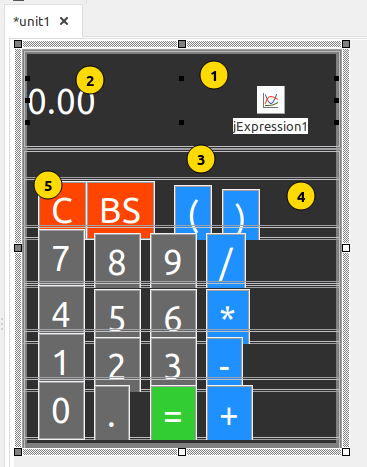
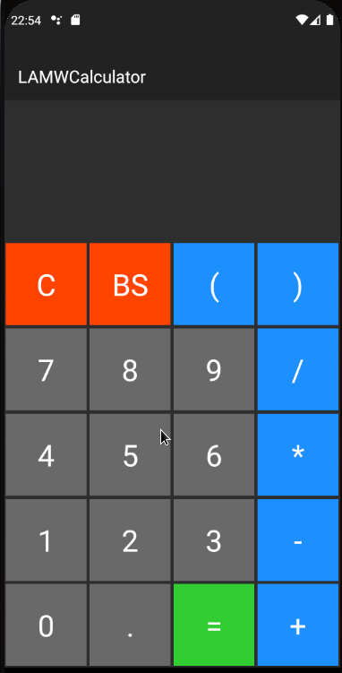

#### Intro

Inicialmente, apenas mais uma calculadora para Android. Mas pretendo incluir mais algumas funcionalidades no decorrer do meu aprendizado com o LAMW. 

#### jExpression

Componenete não visual que faz a interface com o [exp4j](https://www.objecthunter.net/exp4j/). Permite a avaliação de expressões matemáticas até com variáveis. Algo do tipo ```3 * sin(y) - 2 / (x - 2)*``` e muito mais. Estou utilizando apenas as 4 operações mais exponenciação (clicando duas vezes no asterisco). 

#### Layout

Apesar de parecer meio complexo, a criação da tela é relativamente simples. Cria-se um componente e copia-se quantas vezes forem necessárias.



1. Um *jLinearLayout* ocupando toda a largura da tela.

2. Um *jTextView* alinhado pela direita e ocupando toda a largura do componente pai. 

3. Um *jLinearLayout* ocupando o resto da tela, ancorado abaixo jLinearLayout 1 com a inclusão dos componenetes verticalmente.

4. Um *jLinearLayout* (dentro do jLinearLayout 3). O padrão é organizar os componentes horizontalmente.

5. Um *jButton* com o evento OnClick especificado para um procedimento. Depois copiamos três vezes o botão dentro do jLinearLayout. Só arrastamos os botões para não ficarem um em cima do outro.

6. Copiamos 4 vezes o jLinearLayout 4 dentro do jLinearLyout3. Novamente, arrastamos para não ficarem sobrepostos.

7. Colocamos o texto desejado em cada botão e trocamos a cor de fundo de alguns para a calculadora ficar mais interessante.

8. Colocamos um componente *jExpression* para efetuar as avaliações dos cáculos.

#### Programa

O programa pois duas rotinas principais. A primeira é responsável pelo processamento do botão pressionado.

```objectpascal
procedure TAndroidModule1.jButton1Click(Sender: TObject);
var
  op: Char;
  dsp: String;
begin
  op := (Sender as jButton).Text[1];
  if Dirty then begin
    dsp:='';
    Dirty:=False;
  end else
    dsp:=txtDisplay.Text;
  case op of
  'C' : dsp:='';
  'B' : dsp:=LeftStr(dsp,Length(dsp)-1);
  '=' : dsp:=Evaluate;
  else
    if (op='*') and (dsp.EndsWith('*')) then
      dsp[Length(dsp)]:='^'
    else
      dsp+=op;
  end;
  txtDisplay.Text:=dsp;
end;  
```

A variável **Dirty** indica se devemos limpar ou não o display antes de processar a tecla pressionada (na realidade, deveria aceitar as operações sem limpar o resultado do cálculo anterior). Usei uma variável **dsp** apenas para facilitar algumas operações com o conteúdo do display. A variável **op** contém o primeiro caractere do texto do botão e servirá para ver qual o procedimento deverá ser efetuado. C limpa o display, B apaga o último operador ou número introduzido, = avalia a expressão do visor. caso contrário será adicionado no final do visor. Se for * e o último elemento também é um * troca por exponenciação.  Sim, ficaria mais bonitinho se em vez de **/** apresentasse **÷** , de ***** fosse **×** e outras coisinhas. Quem sabe, no futuro. 

A rotina de avaliação da expressão ficou assim:

```objectpascal
function TAndroidModule1.Evaluate:string;
begin
  Dirty:=True;
  jExpression1.SetFormula(txtDisplay.Text,[]);
  Result:='Erro';
  if jExpression1.IsExpressionValid(False) then
    if jExpression1.CanEvaluate(False) then
      Result:=FloatToStr(jExpression1.GetValue)
end;   
```

Se a expressão do display for válida e puder ser calculada, retornamos o resultado.

E assim termina a nossa calculadora. 


