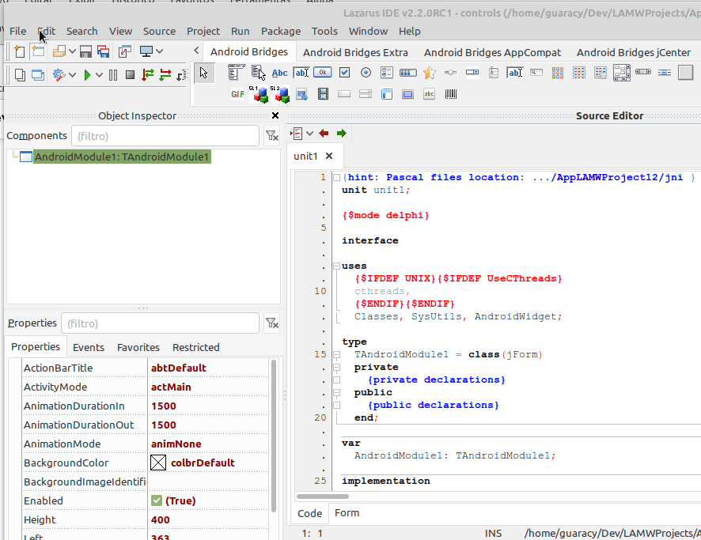

Menus


Para colocar um menu na sua janela, use o componenete

#### jMenu

As duas propriedades mais importantes são o **Options** onde você pode colocar o texto de cada opção do menu e **IconIdentifiers** onde se coloca o nome do arquivo de ícone correspondente a cada oção. Os ícones são opcionais e você poderá passar uma string em branco ou algo com **'null'**.

Os eventos para a criação e click são efetuados pelo **AndroidModule** (equivalente ao Form do Lazarus). O evento

#### OnCreateOptionMenu

é utilizado para a criação do menu. Para tanto, usamos um procedimento do tipo:

```objectpascal
procedure AddItem(_menu: jObjMenu; 
                  _itemID: integer; 
                  _caption: string; 
                  _iconIdentifier: string; 
                  _itemType: TMenuItemType; 
                  _showAsAction: TMenuItemShowAsAction);

```

- jObjMenu é fornecido pelo procedimento.

- itemID é o identificador que utilizamos para saber qual item foi clicado.

- caption é o texto que ira aparecer no menu. Você pode armazenar na propriedade Options do menu.

- iconIdentifier é o nome do arquivo que contém o ícone para o item correspondente.

- itemType pode ser:
  
  - mitDefault se deseja apenas o título do menu
  
  - mitCheckable se, além do título se você deseja um checkbox que poderá ser marcado ou desmarcado

- showAsAction pode ser
  
  - misNever ou misNone se o item aparecerá apenas quando o botão for clicado.
  
  - misIfRoom o item será mostrado na ActionBar se tiver espaço (aqui aparecem apenas dois). O ícone tem preferência sobre o título
  
  - misAlways será mostrado na ActionBar sempre (se tiver muitos poderá ficar maio bagunçado)
  
  - misIfRoomWithText (aqui o texto não apareceu; funcionou como misIfRoom)
    misAlwaysWithText (aqui o texto não apareceu; funcionou como misAlways)

O procedimento completo para a geração do menu pode ser

```objectpascal
procedure TAndroidModule1.AndroidModule1CreateOptionMenu(Sender: TObject;
  jObjMenu: jObject);
var
  i: Integer;
begin
  jMenu1.AddItem(jObjMenu, 101, 'Home', 'ic_home' , mitDefault,   misIfRoom);
  jMenu1.AddItem(jObjMenu, 102, 'Sobre', 'ic_info' , mitDefault,   misIfRoom);
  for i:=0 to jMenu1.Options.Count-1 do begin
    jMenu1.AddItem(jObjMenu, i+10, jMenu1.Options[i], jMenu1.IconIdentifiers[i] , mitDefault,   misNever);
  end;
end;    
```

Quando um menu é clicado, o evento 

#### ClickOptionMenuItem

é chamado e são passados itemID para você saber qual a opção recebeu o click, o título da opção (?) e se está marcado ou não caso seja mitCheckable. É só escolher as ações necessárias. O código será mostrado abaixo.

Para criar novas janelas, utilizamos File -> New e selecionamos LAMW [GUI] Android jForm.



Depois criamos colocamos um jPanel com as dimensões desejadas e escolhemos uma cor de fundo para garantir que não apareça nada da janela anterior.

Em onActivityCreate criamos as novas janelas como:

```objectpascal
procedure TAndroidModule1.AndroidModule1ActivityCreate(Sender: TObject;
  intentData: jObject);
begin
  if AndroidModule2 = nil then
    gApp.CreateForm(TAndroidModule2, AndroidModule2);
  if AndroidModule3 = nil then
    gApp.CreateForm(TAndroidModule3, AndroidModule3);
end;    
```

Para visualizarmos determinada janela, inicializamos a mesma (se não estiver inicializada), e especificamos que o pai é o painel da janela principal. Um BringToFront irá mostrar a janela. Na

#### unit2

foi colocado um jPanel, um jLinearLayout com um jButton para retornar para a página anterior (jWebView1.GoBack), um jTextView para mostrar a URL da linhguagem escolhida, e um jWebView para mostrar a página da linguagem.

e na

#### unit3

uma página Sobre, bem pobre, apenas com um jPanel e um jTextView com uma mensagem.

Quando o menu recebe um click, é executada a seguinte rotina:

```objectpascal
procedure TAndroidModule1.AndroidModule1ClickOptionMenuItem(Sender: TObject;
  jObjMenuItem: jObject; itemID: integer; itemCaption: string; checked: boolean
  );
begin
  if itemID=101 then begin
    Self.SetTitleActionBar('Home');
    Self.jPanel2.BringToFront();
    exit;
  end;
  if itemID=102 then begin
    if not AndroidModule3.Initialized then begin
      AndroidModule3.Init(gApp);
      AndroidModule3.jPanel1.Parent:= Self.jPanel1;
      AndroidModule3.jPanel1.SetViewParent(Self.jPanel1.View);
    end;
    SetTitleActionBar('Sobre');
    AndroidModule3.jPanel1.BringToFront();
    exit;
  end;
  ShowMessage('Abrindo página de '+itemCaption+'. Aguarde!');
  if not AndroidModule2.Initialized then begin
    AndroidModule2.Init(gApp);
    AndroidModule2.jPanel1.Parent:= Self.jPanel1;
    AndroidModule2.jPanel1.SetViewParent(Self.jPanel1.View);
  end;
  SetTitleActionBar('Navegador');
  AndroidModule2.jPanel1.BringToFront();
  case itemID of
    10 : AndroidModule2.jWebView1.Navigate('https://www.lazarus-ide.org/');
    11 : AndroidModule2.jWebView1.Navigate('https://www.red-lang.org/');
    12 : AndroidModule2.jWebView1.Navigate('https://beadslang.org/');
    13 : AndroidModule2.jWebView1.Navigate('https://elm-lang.org/');
    14 : AndroidModule2.jWebView1.Navigate('https://www2.cs.arizona.edu/icon/');
    15 : AndroidModule2.jWebView1.Navigate('https://nim-lang.org/');
    16 : AndroidModule2.jWebView1.Navigate('https://www.jsoftware.com/');
  end;
end;

```

Se o itemID for 101, mostra a página principal. Se for 102, mostra a página do sobre. Se for entre 10 e 16, mostra a página com o navegador e carrega a página correspondente.

E era isto.
