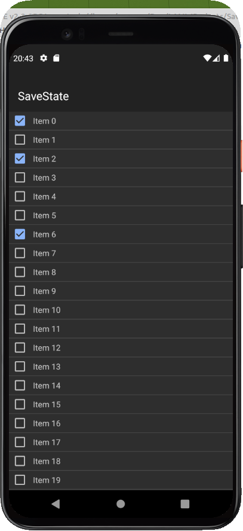

## Intro

Na maioria das vezes precisamos que o nosso programa salve alguma preferência ou o estado de algum componenete para execuções futuras. Em aplicações para o Android, a tarefa é muitop fácil utilizando o LAMW. Basta colocar o componenete jPreferences.

## jPreferences

 Os valores são armazenados no formato **chave=valor**.  Trabalha com cinco tipos de valores que são **Int** para valores inteiros, **Long** para inteiros de 64 bits, **Float** para números decimais, **Bool** para valores lógicos e **String** para cadeias de caracteres.

Utiliza-se **Set<tipo>Data(chave,valor)** para gravar um valor e **Get<tipo>Data(chave,default)** para ler um valor. 

Para limpar todos os dados, basta chamar o método **Clear**.

## Programa

As duas principais partes do programa é a rotina que inicializa a lista (ajustando o estado de cada item)

Note que iniciamos a lista com 50 itens. Mas poderíamos ter algo como `numItens:=jPreferences1.GetIntData('numItens',50);`. Se não tiver nada salvo assume 50, caso contrário o número de itens na lista.

```objectpascal
procedure TAndroidModule1.AndroidModule1Show(Sender: TObject);
var
  i: Integer;
  s: String;
begin
  for i:=0 to 50 do begin
      s:='Item '+i.ToString;
      jListView1.Add(s);
      jListView1.SetWidgetCheck(jPreferences1.GetBoolData(s,false),i);
  end;
end;   
```

e a rotina que ajusta o novo valor do item

```objectpascal
procedure TAndroidModule1.jListView1ClickWidgetItem(Sender: TObject;
  itemIndex: integer; checked: boolean);
begin
   jPreferences1.SetBoolData(jListView1.Items[itemIndex],checked);
end;  
```

O resultado final fica assim:


